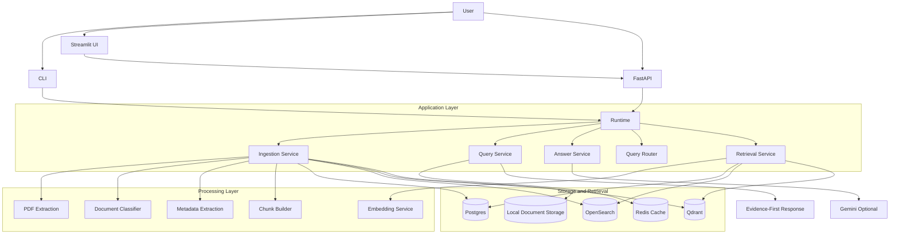
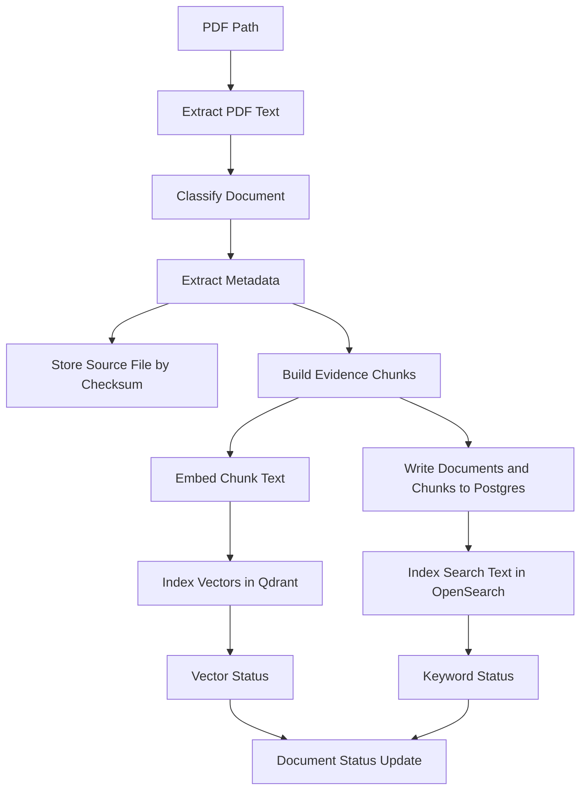
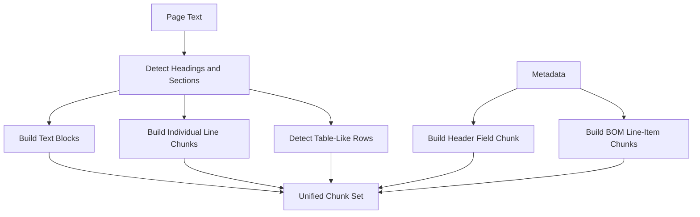
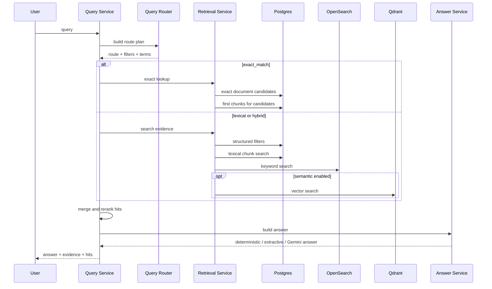
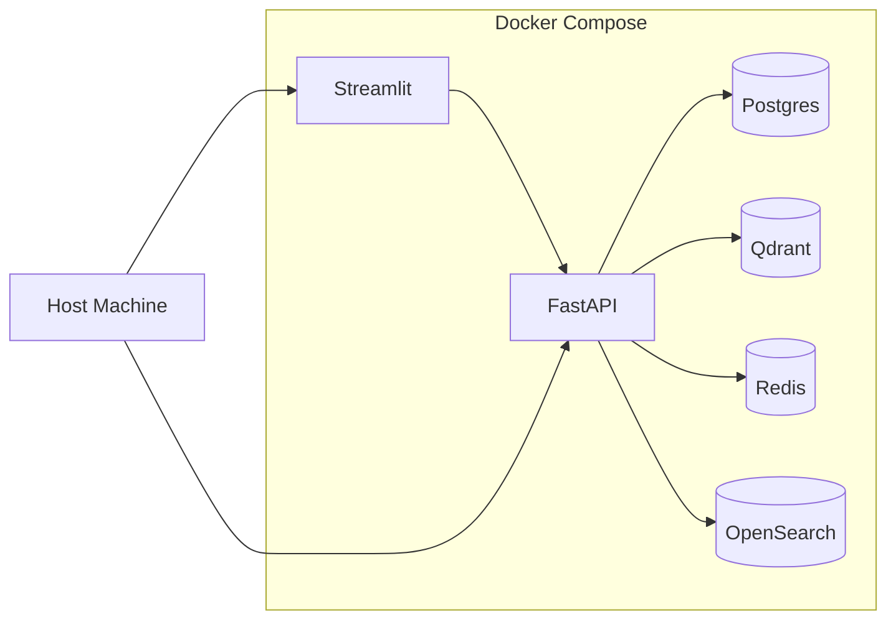

# System Design

## 1. Executive Summary

`Factory Document RAG` is a retrieval-first document search system for factory and operations workflows. It is built to help users locate and verify information inside GST invoices, bills of materials, e-way bills, and financial PDFs.

The system supports:

- PDF ingestion from folders or single files
- text extraction and lightweight metadata enrichment
- multi-granularity evidence chunking
- lexical, structured, and semantic retrieval across multiple stores
- evidence-first query responses through CLI, FastAPI, and Streamlit
- optional Gemini-based answer synthesis on top of retrieved evidence
- retrieval and extraction evaluation datasets and runners
- local Docker Compose deployment for a small internal team

This document describes the **implemented** system in this repository.

---

## 2. Goals and Scope

### 2.1 Functional Goals

The current system is designed to:

- ingest document PDFs into a searchable corpus
- preserve source-file traceability through stored document copies
- support exact identifier lookup for document numbers and similar business keys
- support line-item and material lookup inside dense tables
- combine lexical and semantic retrieval where useful
- return evidence with file path, page, snippet, and confidence
- provide both developer-facing and business-facing interfaces
- evaluate retrieval and extraction behavior with local benchmark sets

### 2.2 Explicitly in Scope Today

- local-first document ingestion
- inbox-based bulk ingestion through Streamlit and API
- native-text PDF extraction
- lightweight document classification
- metadata extraction with small canonical schema plus flexible extras
- Postgres document and chunk store
- OpenSearch keyword retrieval
- Qdrant vector retrieval
- Redis query cache
- FastAPI search service
- Streamlit search interface
- local Docker Compose deployment
- benchmark and unit test support

### 2.3 Further Improvements

- OCR-first scanned-document pipelines
- universal structured extraction across arbitrary formats
- multi-tenant auth, RBAC or enterprise user management
- asynchronous worker queues
- cloud autoscaling or Kubernetes deployment
- document editing, annotation, or approval workflows
- agentic extraction chains beyond optional answer summarization

---

## 3. Product Direction

The core design decision in this repository is **retrieval-first rather than parser-first**.

That means the system is optimized for questions such as:

- “Find invoice `TF/2026-27/001`”
- “Which item has rate `85000.00`?”
- “Find material code for `Seat Foam Cushion`”
- “Vehicle number for e-way bill `FM-GST-2026-2001`”

This design was chosen because factory document search is dominated by:

- identifiers
- supplier names
- totals, rates, and quantities
- line-item descriptions
- material codes
- table-heavy PDF layouts

A parser-first architecture tends to become brittle when supplier formats shift. A retrieval-first architecture tolerates more document variation because it treats parsing as enrichment rather than as the single source of truth.

---

## 4. High-Level Architecture

### 4.1 Component Map

### 4.2 Runtime Responsibilities

| Layer | Components | Responsibility |
|---|---|---|
| Interfaces | CLI, FastAPI, Streamlit | user interaction and service access |
| Runtime | `Runtime` | shared wiring of stores and services |
| Ingestion | extraction, classifier, metadata, chunking | build indexed searchable corpus |
| Retrieval | router, retrieval service, reranker | find and rank relevant evidence |
| Answering | deterministic/extractive/Gemini | convert top evidence into a concise answer |
| Storage | Postgres, OpenSearch, Qdrant, Redis, local files | persistence, search, cache, file traceability |
| Evaluation | eval runners and datasets | benchmark retrieval and extraction quality |

---

## 5. Core Design Principles

### 5.1 Retrieval First

The product is designed to find the right document and evidence snippet before attempting to summarize anything.

### 5.2 Evidence First

Every successful result is tied back to:

- document number or file name
- file location
- page number
- snippet or nearby context

### 5.3 Small Canonical Schema

A small stable schema is extracted into canonical fields such as:

- `doc_number`
- `supplier_name`
- `buyer_name`
- `doc_date`
- `amount`
- `currency`
- `part_number`

Everything else remains in flexible metadata.

### 5.4 Lexical Strength for Business Keys

Business documents are often searched by identifiers and values, so lexical retrieval is prioritized for:

- document numbers
- rates
- totals
- GSTINs
- material codes
- supplier names

### 5.5 Semantic Retrieval as a Complement

Vector retrieval is used to improve fuzzier text search, not to replace lexical retrieval.

### 5.6 Local-First Deployment

The system is intentionally deployable on a small business setup with a single machine or lightweight local stack.

---

## 6. Ingestion Design

### 6.1 Ingestion Flow

The same ingestion pipeline can be triggered in three ways:

- CLI path-based ingestion
- general API path-based ingestion
- configured inbox ingestion through `POST /documents/ingest/inbox`

### 6.2 PDF Extraction

Implemented behavior:

- uses `PyMuPDF` (`fitz`) to extract page text
- stores page-level text and full document text
- assumes native-text PDFs rather than scanned-image OCR

### 6.3 Document Classification

Current classifier is lightweight and keyword-based:

- BOM if text contains “bill of material”
- invoice if text contains “tax invoice”, “invoice no”, or “invoice number”
- receipt if text contains “receipt”
- otherwise `unknown`

This is intentionally simple. Classification is used as routing metadata rather than a strict product dependency.

### 6.4 Metadata Extraction

Metadata extraction currently combines:

- label/value heuristics
- field alias matching
- regex fallbacks
- BOM-specific line-item extraction

The extraction model is not intended to be universal across arbitrary layouts. It provides:

- canonical metadata used for filtering and display
- extra fields stored into flexible metadata
- BOM line-item enrichment where a recognizable table is found

### 6.5 Document Storage

Source PDFs are copied into a local storage directory using:

- SHA-256 checksum as filename
- original extension preserved

This guarantees:

- stable file traceability
- deduplication support
- storage path citation in responses

### 6.6 Duplicate Handling

At ingestion time the system:

- computes a file checksum
- checks Postgres for an existing processed document with the same checksum
- returns `duplicate` unless `--force` is used

If `force` is used, vector and keyword indexes are rebuilt for that document.

### 6.7 Current Inbox Workflow

The current UI-facing operational ingestion path uses a configured inbox directory:

- users place PDFs into a shared inbox folder
- Streamlit calls the inbox ingestion API
- the backend bulk-processes every PDF in that folder
- checksum deduplication prevents reprocessing of identical files

This design is intentionally simple and works well for a small office environment where users do not interact with the CLI or filesystem paths directly.

### 6.8 Recommended Production-Style Ingestion Improvement

The recommended next operational step is to evolve the current inbox flow into a scheduled ingestion pipeline with folder lifecycle management:

- `incoming/` for new files
- `processed/` for successful ingests
- `failed/` for files needing review
- scheduled execution every few minutes or at a fixed daily time
- persistent checksum-based deduplication and ingestion manifest tracking

This is preferable to “ingest by date placed in folder” because file timestamps are fragile, while checksum and ingestion-state tracking are durable and idempotent.

---

## 7. Evidence Chunking Design

### 7.1 Why Multiple Evidence Types

A single chunking strategy is not enough for factory documents because:

- headers are useful for document lookup
- lines are useful for concise evidence
- table rows are useful for rates, quantities, and material codes
- larger text chunks are useful for fuzzier semantic queries

### 7.2 Implemented Evidence Types

The system currently builds:

- `text_chunk`
- `line_chunk`
- `table_row`
- `header_field`

### 7.3 Chunking Flow

### 7.4 Design Tradeoff

This chunking design is intentionally redundant. The same document may generate multiple evidence representations because different query types need different granularities.

---

## 8. Storage and Retrieval Layer Design

### 8.1 Postgres

Postgres is the primary system of record for:

- suppliers
- documents
- chunks
- query logs

It also supports lexical retrieval through:

- canonical metadata filtering
- `search_text` normalization
- PostgreSQL full-text search and `ILIKE` matching

### 8.2 OpenSearch

OpenSearch provides keyword retrieval over indexed chunk content.

It complements Postgres by handling broader lexical retrieval over chunk text.

### 8.3 Qdrant

Qdrant stores vector embeddings for chunk-level semantic retrieval.

Vector retrieval is used selectively and weighted lower than lexical retrieval for many business queries.

### 8.4 Redis

Redis is used only as a query-response cache in the current implementation.

It stores serialized query results keyed by:

- normalized query text
- requested hit limit

### 8.5 Local Document Storage

The local document store preserves a physical copy of ingested PDFs and enables file-path citations in results.

---

## 9. Data Model

### 9.1 Core Tables

Implemented relational model:

- `suppliers`
- `documents`
- `chunks`
- `query_logs`

### 9.2 Important Document Fields

The `documents` table stores:

- checksum
- source filename
- storage path
- document type
- document number
- supplier link
- buyer name
- document date
- amount
- currency
- metadata JSON
- processing status

### 9.3 Important Chunk Fields

The `chunks` table stores:

- chunk index
- page number
- section
- chunk text
- normalized search text
- embedding model
- evidence type
- Qdrant point ID

### 9.4 Why Both Canonical Fields and JSON Metadata

Canonical fields are kept small for:

- filtering
- ranking
- display
- stable schema

Flexible metadata is stored in JSON to avoid hard-coding every supplier-specific field into the database schema.

---

## 10. Retrieval Design

### 10.1 Retrieval Strategy

The system supports three main retrieval modes:

1. `exact_match`
2. `lexical`
3. `hybrid`

There is also an internal `mixed` route used when semantic and lexical evidence should both contribute but lexical precision still matters.

### 10.2 Query Routing Logic

Routing is rule-based, using:

- extracted filters
- identifier detection
- numeric-heavy query detection
- row-level intent detection
- semantic suitability of the query text

Routing rules intentionally favor lexical retrieval for:

- document numbers
- amounts
- rates
- line-item questions
- material code questions

Hybrid retrieval is used mainly for broader semantic text queries.

### 10.3 Retrieval Flow

### 10.4 Fusion Strategy

The system does **not** currently implement Reciprocal Rank Fusion.

Instead, it uses:

- weighted score normalization by retrieval source
- score accumulation across sources
- query-aware reranking in `QueryService`

Weights vary by route:

- lexical-heavy routes weight Postgres and OpenSearch more
- hybrid routes give Qdrant more influence

### 10.5 Reranking Design

After retrieval, the query service applies a second ranking stage using:

- exact numeric matches
- exact text-term overlap
- evidence type preference
- row-query boosts for `table_row`
- context penalties for header-only hits when row evidence is expected
- source tie-breakers that prefer stronger lexical evidence

This reranking layer is one of the main reasons the system performs better than a naive “vector top-k” pipeline on document search tasks.

---

## 11. Answer Generation Design

### 11.1 Answer Modes

The system supports four answer behaviors:

1. deterministic answer for exact identifier hits
2. extractive row-level answer for line-item style questions
3. Gemini summary if enabled and configured
4. simple extractive fallback using top hits

### 11.2 Design Choice

The answer layer is intentionally secondary. The system is designed so that:

- retrieval finds the evidence
- the answer service formats or summarizes it

This avoids positioning the LLM as the source of truth.

### 11.3 Gemini Usage

Gemini is used only after retrieval and only when enabled.

This is a deliberate design choice because identifiers, rates, codes, and amounts are retrieval problems first and generation problems second.

---

## 12. Deployment Design

### 12.1 Current Deployment Model

The project uses Docker Compose to launch:

- API container
- Streamlit container
- Postgres
- Qdrant
- Redis
- OpenSearch

### 12.2 Compose Topology

### 12.3 Deployment Assumption

This deployment is appropriate for:

- local development
- a demo environment
- a small business team with a single shared machine

In that environment, a practical operational model is:

- one office machine runs Docker Compose
- users save PDFs into a shared folder mounted into the API container
- the inbox API or scheduled job ingests new files
- users search through Streamlit in a browser

It is not yet optimized for distributed production infrastructure.

---

## 13. User Interfaces

### 13.1 CLI

The CLI provides:

- `bootstrap`
- `ingest`
- `query`
- `find`
- `validate`
- `evaluate`
- `evaluate-retrieval`
- `serve`
- `health`

`query` is verbose and inspection-oriented.

`find` is the concise business-facing command.

### 13.2 FastAPI

The API provides:

- service health
- metrics
- document ingestion
- inbox discovery
- inbox-based bulk ingestion
- document lookup
- verbose search
- concise search

The concise search endpoint is `POST /find`, designed for UI and business-facing consumption.

### 13.3 Streamlit

The Streamlit app is intentionally thin. It delegates retrieval to the API and focuses on:

- one search box
- inbox-triggered document intake
- top match display
- additional matches
- clear file/page/snippet presentation

This keeps UI logic simple and consistent with backend behavior.

---

## 14. Evaluation Design

### 14.1 Why Evaluation Exists

This system is not just a prototype interface. It includes explicit evaluation so retrieval quality can be discussed with evidence.

### 14.2 Retrieval Evaluation

Retrieval evaluation measures:

- `Recall@1`
- `Recall@3`
- `Recall@5`
- `Snippet@1`
- `Snippet@3`
- `Snippet@5`
- `MRR`

Latest holdout retrieval snapshot:

- Queries: `36`
- `Recall@1`: `0.8611`
- `Recall@3`: `0.9722`
- `Recall@5`: `1.0`
- `Snippet@1`: `0.5556`
- `Snippet@3`: `0.6944`
- `Snippet@5`: `0.7778`
- `MRR`: `0.9222`

### 14.3 Extraction Evaluation

Extraction evaluation measures:

- document pass rate
- field accuracy
- line-item accuracy

Latest holdout extraction snapshot:

- Documents passed: `6/18`
- Field accuracy: `0.5591`
- Line item accuracy: `0.7222`

### 14.4 Interpretation

The benchmark results support the current positioning:

- retrieval quality is strong enough for a practical search system

---

## 15. Testing Strategy

The repository includes unit tests covering:

- generic document ID extraction
- query filter behavior
- date normalization
- BOM parsing behavior
- router behavior across retrieval modes

This test suite is intentionally narrow but useful. It protects the retrieval-first routing and normalization logic that has the highest impact on benchmark quality.

---

## 16. Design Tradeoffs and Rationale

### 16.1 Why Not Parser-First

A parser-first system would require frequent rule changes for:

- supplier-specific layouts
- field order changes
- alternate table headers
- different invoice formats

That is the wrong center of gravity for the current product goal.

### 16.2 Why Multiple Retrieval Stores

No single store serves all document search needs well:

- Postgres is good for metadata, exact filters, and normalized lexical search
- OpenSearch helps broader keyword retrieval
- Qdrant helps fuzzier semantic queries
- Redis improves response time for repeated queries

### 16.3 Why Rule-Based Routing

For document search, route selection benefits from explicit logic:

- exact identifiers should not be treated as fuzzy semantic search
- numeric-heavy questions should not default to vector similarity
- line-item queries should bias toward row-level evidence

### 16.4 Why Local-First

The target environment is closer to:

- a small operations team
- a local machine or simple shared system
- limited infrastructure maturity

than to a cloud-native platform team.

---

## 17. Current Limitations

Important current limitations include:

- OCR/scanned-document support is limited
- extraction remains weak across unseen layouts
- financial statement retrieval is weaker than invoice and BOM retrieval
- there is no human review workflow or extraction correction interface
- there is no background job queue for large ingestion workloads

---

## 18. Recommended Next Steps

The most valuable next improvements are:

1. improve snippet selection and nearby-context reconstruction
2. strengthen financial-statement retrieval and row-level evidence
3. add saved evaluation reports in JSON/CSV
4. add OCR support for scanned PDFs
5. expand benchmark coverage with more unseen supplier formats
6. add scheduled inbox ingestion with `incoming / processed / failed` folders
7. move long-running ingestion to an asynchronous job model
8. optionally add selective low-confidence extraction fallback with an LLM, while preserving retrieval-first architecture

---

## 19. Reading Order

For someone new to the repository, a practical code-reading order is:

1. `README.md`
2. `system_design.md`
3. `docker-compose.yml`
4. `src/factory_rag/core/runtime.py`
5. `src/factory_rag/api.py`
6. `src/factory_rag/services/ingestion_service.py`
7. `src/factory_rag/processing/chunking.py`
8. `src/factory_rag/processing/metadata.py`
9. `src/factory_rag/processing/router.py`
10. `src/factory_rag/services/retrieval.py`
11. `src/factory_rag/services/query_service.py`
12. `src/factory_rag/services/answer_service.py`
13. `src/factory_rag/stores/postgres.py`
14. `apps/streamlit_app.py`
15. `eval/` and `tests/`

---
